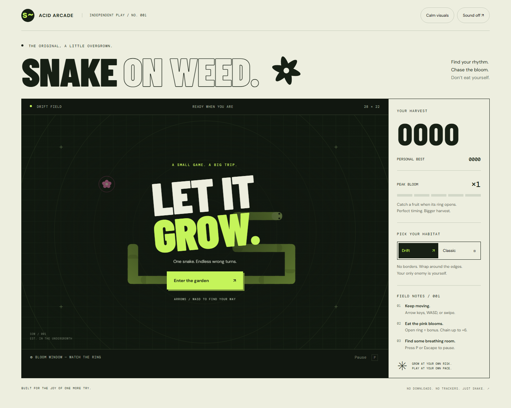

# Snake on Weed · Acid Arcade

**[Play on Vercel](https://snake-on-weed-arcade.vercel.app/)** ? [GitHub Pages mirror](https://maca2024.github.io/snake-on-weed-/)



A small game. A big trip. A browser arcade with a botanical grid, neon snake, pink blooms, and one more reason to try again.

The original `snake_on_weed.py` and `snake_backup.py` are preserved. The browser edition is independent: static HTML, CSS, JavaScript modules, Canvas 2D, and locally hosted fonts. No accounts, analytics, API keys, or model calls are required to play.

## Play locally

```sh
python -m http.server 4173 --bind 127.0.0.1
```

Open **http://127.0.0.1:4173**. Use an HTTP server; ES modules do not reliably load from `file://`.

| Control | Action |
| --- | --- |
| Arrow keys / WASD | Steer; up to two turns are buffered |
| Swipe / on-screen arrows | Steer on touchscreens |
| P / Escape | Pause or resume |
| Space, with arena focused | Start, pause, or resume |
| Sound | Opt into synthesized sound |
| Calm visuals | Disable decorative motion; game rules stay identical |

**Drift** wraps across the edges. **Classic** ends the run at a wall. Your own body is dangerous in both modes; moving into the tail cell as it leaves is legal.

**Peak Bloom:** eat when the fruit's ring opens to build a multiplier. Consecutive peak pickups score 20, 30, 40, 50, then 60 points; normal pickups score 10 and reset the bonus. The peak window occupies simulation ticks 14–25 of a repeating 40-tick fruit cycle. Pausing freezes this timing. Speed gradually increases from 145 ms per move toward a 78 ms floor. Best scores are stored separately per mode in your browser.

## Check the game

Node 22+ runs the engine tests without installing JavaScript dependencies:

```sh
npm test
```

Browser checks need Python 3.12+ and Playwright:

```sh
python -m pip install playwright==1.55.0
python -m playwright install chromium
python scripts/test_browser.py
```

The wrapper starts an isolated server on a free port, runs desktop/mobile checks, saves screenshots and a JSON report under `test-results/`, and stops its server. GitHub Actions runs both test suites and uploads browser evidence. A successful push to `main` then publishes only `index.html`, `src/`, and `assets/` to GitHub Pages. Run `python scripts/build_site.py` to produce the same minimal `dist/` directory locally.

## Eight-model collaboration

The Kathedraal LiteLLM proxy was used for an actual design and code-review exercise: Claude Opus, Astra, Gemini Flash, Mistral Large, Grok, DeepSeek, Kimi, and GLM, with Codex as integrator. This is development tooling, not a runtime dependency.

Raw provider outputs, response status, finish reasons, deployment IDs, and reported token usage are in [`docs/orchestration/`](docs/orchestration/). Generated advice was reviewed before implementation; it is not test evidence. [`CONTEXT.md`](CONTEXT.md) records architecture and current verification.

The optional runner requires `httpx` and is intended for the Kathedraal host, where it reads the proxy key from the `litellm` Docker container without printing it:

```sh
python3 scripts/swarm.py --phase review --context /tmp/snake-source.txt --output /tmp/snake-review
```

Do not place a proxy key in the browser, source files, or reports. Calls use three-way concurrency, explicit budgets, zero retries, and disabled fallback so provider participation remains attributable. `--models gemini-flash` can target a failed contribution without rerunning all eight.

## Files and limitations

- `src/engine.js`: deterministic grid rules and seeded food placement.
- `src/main.js`: input, fixed-step loop, canvas, audio, HUD, and storage.
- `src/style.css`: responsive arcade layout and reduced-motion styling.
- `assets/fonts/`: Barlow Condensed, DM Sans, and DM Mono with SIL Open Font License notices.
- `scripts/`: repeatable browser tests and optional LiteLLM orchestration.

Browser validation targets Chromium. Sound depends on browser audio support. The canvas game remains a visual spatial game; DOM controls and score announcements do not make it fully playable without sight. No awards are claimed.

The repository's pre-existing tracked `venv/` is retained to avoid deleting original work. It is not required for the browser edition and should not be deployed. For the original Python game, create your own environment and install Pygame instead of relying on the checked-in environment.

## Vercel deployment

The GitHub repository is connected to the Vercel project `snake-on-weed-arcade`. Production URL: https://snake-on-weed-arcade.vercel.app/.

`vercel.json` runs `node scripts/build_site.mjs` and serves `dist/`. The build copies only the game entry point, source, and local assets. `.vercelignore` excludes the original Python environment, model reports, and test tooling from uploads. Project credentials and `.vercel/` are not committed.

For an authenticated CLI deployment from this repository:

```sh
vercel link --yes --project snake-on-weed-arcade --scope aetherlinks-projects-ef204315
vercel deploy --prod --yes --scope aetherlinks-projects-ef204315
```

The first production deployment passed all 19 browser checks, and the HTML, JavaScript, CSS, and local font files returned HTTP 200. Evidence: `docs/verification/vercel.json`.
